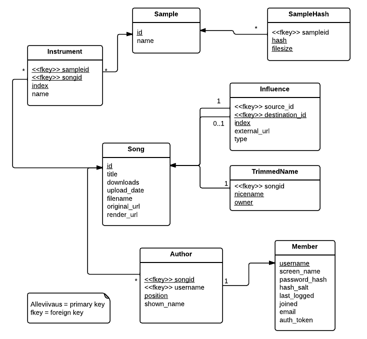

## Tietokanta



```sql
CREATE SCHEMA ms; 

CREATE TYPE member_type AS ENUM ('banned','guest','member','moderator','admin');
CREATE TYPE influence_type AS ENUM ('remix','inspiration','sample','cover');

CREATE TABLE ms.Member (
    username        varchar PRIMARY KEY,
    screen_name     varchar NOT NULL,
    password_hash   varchar NOT NULL,
    hash_salt       varchar NOT NULL,
    last_logged     timestamptz,
    joined          timestamptz NOT NULL DEFAULT CURRENT_TIMESTAMP,
    email           varchar,
    auth_token      varchar,
    member_type     member_type DEFAULT 'member'
);

CREATE TABLE ms.Song (
    id              serial PRIMARY KEY,
    title           varchar NOT NULL,
    upload_date     timestamptz NOT NULL DEFAULT CURRENT_TIMESTAMP,
    downloads       integer NOT NULL DEFAULT 0,
	filename		varchar NOT NULL,
    original_url    varchar NOT NULL,
    render_url      varchar
);

CREATE TABLE ms.Author (
    songid          integer references ms.Song(id) NOT NULL,
    -- if username is NULL, we don't create a hyperlink on the song page
    username        varchar references ms.Member(username),   
    position        integer NOT NULL, 
    shown_name      varchar NOT NULL,
    PRIMARY KEY(songid, position)
);

CREATE TABLE ms.TrimmedName (
    songid          integer references ms.Song(id) NOT NULL,
    nicename        varchar NOT NULL,
	owner			varchar NOT NULL,
	PRIMARY KEY(nicename, owner)
);

-- either destination_id or external_url should be NULL
CREATE TABLE ms.Influence (
    source_id       integer  references ms.Song(id) NOT NULL,
    destination_id  integer  references ms.Song(id),
    -- each source_id has its own set of indices
    index           integer NOT NULL,   
    external_url    varchar,
    type            influence_type NOT NULL,
    PRIMARY KEY(source_id, index)
);

CREATE TABLE ms.Sample (
    id          serial PRIMARY KEY,
    name        varchar 
);

CREATE TABLE ms.Instrument (
    sampleid    integer references ms.Sample(id) NOT NULL,
    songid      integer references ms.Song(id) NOT NULL,
    index       integer NOT NULL,
    name        varchar,
    PRIMARY KEY(sampleid, songid, index)
);

CREATE TABLE ms.SampleHash (
    sampleid    integer references ms.Sample(id) NOT NULL,
    hash        varchar NOT NULL,
    filesize    integer NOT NULL,
    PRIMARY KEY(hash, filesize)
);
```
