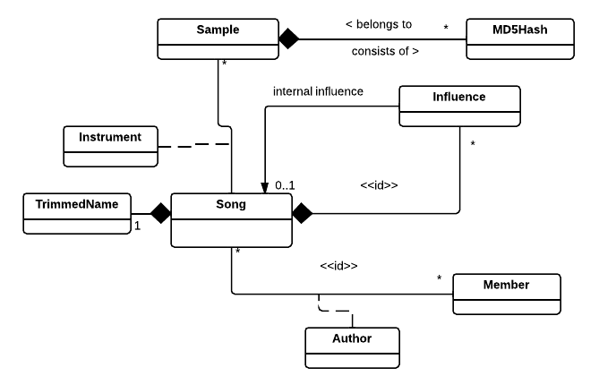

## Tietokohteet

### User
|attribuutti	| arvojoukko 	| kuvailu
|---------------|---------------|----------|
| username		| varchar		| käyttäjänimi
| screen_name	| varchar		| palvelussa näkyvä nimi
| password_hash	| varchar		| salasanan tiiviste
| hash_salt		| varchar(64)	| tiivisteen luonnissa käytetty satunnaisesti arvottu "suola"
| last_logged	| date			| ajanhetki jolloin käyttäjä oli viimeksi aktiivinen palvelussa
| joined		| date			| käyttäjän liittymispäivämäärä
| email			| varchar		| sähköpostiosoite
| auth_token	| varchar		| käyttäjän session tunniste

Käyttäjästä tallennetaan erikseen näyttönimi ja käyttäjänimi, sillä käyttäjä voi haluta vaihtaa nimeään. Kirjautumiseen käytettävä username pysyy kuitenkin samana.

### Author
|attribuutti	| arvojoukko 	| kuvailu
|---------------|---------------|----------|
| position		| integer		| artistin järjestysnumero kappaleen nimessä
| shown_name	| varchar		| artistinimi joka näytetään kappaleen nimen vieressä

Esittää jonkin kappaleen yhtä tekijää. 

### Song
|attribuutti	| arvojoukko 	| kuvailu
|---------------|---------------|----------|
| id			| integer		| kappaleen numeromuotoinen tunniste
| title			| varchar		| kappaleen nimi
| upload_date	| date			| ajanhetki jolloin kappale ladattiin palveluun
| downloads		| integer		| kuinka monta kertaa kappale on ladattu
| original_url	| varchar		| alkuperäiskappaleen latausosoite
| render_url 	| varchar		| mp3-pakatun version latausosoite, voi olla NULL

Song on yksi järjestelmään ladattu kappale. Kappaleeseen liittyy yksi tai useampi käyttäjä (User) Author-roolissa. Kappaleessa voi olla myös listattu useampia käytettyjä instrumentteja (Instrument)

### TrimmedName
|attribuutti	| arvojoukko 	| kuvailu
|---------------|---------------|----------|
| nicename		| varchar		| jonkin kappaleen siistitty nimi

Taulukko kappaleiden siistityille nimille, joita käytetään tunnisteena kappaleen URL:ssä. Tämä on käyttäjälle selkeämpää kuin pelkän numeromuotoisen tunnisteen näyttäminen. 

### Influence
|attribuutti	| arvojoukko 				| kuvailu
|---------------|-------------------		|----------|
| id 			| integer					| kappalekohtainen järjestysnumero
| external_url	| varchar					| viittaus ulkoiseen resurssiin, voi olla NULL
| type			|{remix,inspiration,sample}	| jokin kolmesta enum-tyyppisestä tunnisteesta joka kertoo vaikutteen laadun

Influence esittää yhtä johonkin kappaleeseen kohdistunutta vaikutetta. Yhteen kappaleeseen voi liittyä useampia vaikutteita. Vaikute voi olla joko järjestelmän sisäinen viittaus, tai linkki ulkoiseen resurssiin (external_url).

### Instrument
|attribuutti	| arvojoukko 		| kuvailu
|---------------|-------------------|----------|
| index			| integer			| instrumentin järjestysluku kappaleen listassa
| name			| varchar			| nimi (poimittu alkuperäistiedostosta)

Jonkin kappaleen yksittäinen instrumentti. Yhteen instrumenttiin liittyy yksi ääninäyte (Sample).

### Sample
|attribuutti	| arvojoukko 	| kuvailu
|---------------|---------------|----------|
| id			| integer		| ääninäytteen tunniste
| name			| varchar		| samplen kutsumanimi, voi poiketa alkuperäisestä tiedostonimestä

Samplella tarkoitetaan yhden instrumentin käyttämää ääninäytettä. Sample tunnistetaan MD5-tiivisteestään, ja useampi tiiviste voikin viitata yhteen sampleen.

### SampleHash
|attribuutti	| arvojoukko 	| kuvailu
|---------------|---------------|----------|
| hash			| varchar		| MD5-tiiviste
| filsize		| integer		| tiivistetyn tiedoston koko tavuina

Ääninäytteiden (Sample) tiivisteet.

